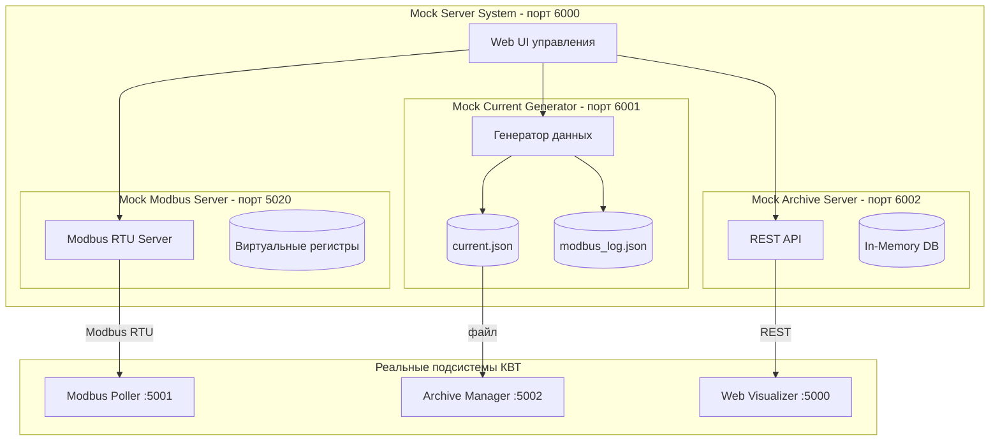
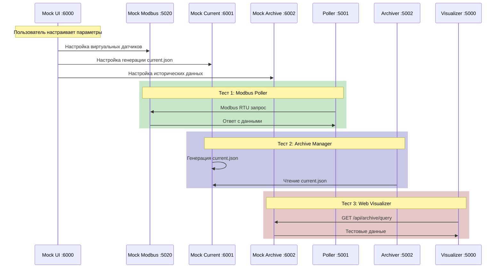

# Техническое задание: Система генерации тестовых данных (Mock Server)

**Версия:** 1.0  
**Дата:** 20.01.2026  

---

## 1. Общие сведения

### 1.1 Назначение системы

Система генерации тестовых данных (Mock Server) предназначена для независимого тестирования каждой из трёх подсистем КВТ без реального оборудования (датчиков С2000-ВТ).

**Основные задачи:**
- Эмуляция Modbus-устройств для тестирования Modbus Poller
- Генерация файла `current.json` для тестирования Archive Manager
- Эмуляция Archive Manager API для тестирования Web Visualizer
- Веб-интерфейс для настройки всех параметров генерации

### 1.2 Целевые подсистемы

| Мок-сервер | Эмулирует | Для тестирования |
|------------|-----------|------------------|
| Mock Modbus Server | Датчики С2000-ВТ | Modbus Poller |
| Mock Current Generator | Modbus Poller | Archive Manager |
| Mock Archive Server | Archive Manager | Web Visualizer |

### 1.3 Порты мок-серверов

| Компонент | Порт | Протокол | Назначение |
|-----------|------|----------|------------|
| Mock Server UI | 8000 | HTTP | Единый веб-интерфейс управления |
| Mock Modbus Server | 5020 | Modbus RTU | Эмуляция Modbus-устройств |
| Mock Current Generator | 6001 | HTTP | API управления генератором |
| Mock Archive Server | 6002 | HTTP | Эмуляция Archive Manager API |

> **Примечание:** Порты выбраны так, чтобы не конфликтовать с реальными подсистемами (5000, 5001, 5002).

### 1.4 Технологический стек

- Python 3.8+
- Flask (веб-интерфейс и API)
- pymodbus (Modbus RTU сервер)
- HTML/CSS/JS (фронтенд управления)

---

## 2. Архитектура системы

### 2.1 Структурная схема



### 2.2 Схема взаимодействия



### 2.3 Выходные файлы

| Генератор | Выходной файл | Путь по умолчанию | Настраиваемый |
|-----------|---------------|-------------------|---------------|
| Mock Current Generator | current.json | `./data/current.json` | Да |
| Mock Current Generator | modbus_log.json | `./data/modbus_log.json` | Да |
| Mock Archive Server | — | В памяти (RAM) | — |

---

## 3. Mock Modbus Server

### 3.1 Назначение

Эмулирует Modbus RTU устройства (датчики С2000-ВТ) для тестирования подсистемы Modbus Poller без реального оборудования.

### 3.2 Функциональные требования

- Modbus RTU сервер на порту 5020
- Поддержка функции 0x04 (Read Input Registers)
- Виртуальные регистры значений (30000+N)
- Виртуальные регистры статусов (40000+N)
- Произвольное количество виртуальных датчиков
- Настраиваемые сценарии поведения данных

### 3.3 Настраиваемые параметры

| Параметр | Тип | По умолчанию | Диапазон | Описание |
|----------|-----|--------------|----------|----------|
| `port` | int | 5020 | 1024-65535 | Порт Modbus RTU сервера |
| `unit_id` | int | 16 | 1-247 | Modbus Unit ID |
| `sensor_count` | int | 10 | 1-127 | Количество виртуальных датчиков |
| `update_interval_ms` | int | 1000 | 100-60000 | Интервал обновления значений |
| `scenario` | string | "normal" | см. п.7 | Сценарий поведения |
| `value_register_base` | int | 30000 | 0-65535 | Базовый адрес регистров значений |
| `status_register_base` | int | 40000 | 0-65535 | Базовый адрес регистров статусов |

### 3.4 Настройки диапазонов значений

| Параметр | Тип | По умолчанию | Описание |
|----------|-----|--------------|----------|
| `temp_min` | float | -40.0 | Минимальная температура (°C) |
| `temp_max` | float | 85.0 | Максимальная температура (°C) |
| `temp_base` | float | 22.0 | Базовое значение температуры |
| `temp_variation` | float | 2.0 | Амплитуда колебаний |
| `hum_min` | float | 0.0 | Минимальная влажность (%) |
| `hum_max` | float | 100.0 | Максимальная влажность (%) |
| `hum_base` | float | 45.0 | Базовое значение влажности |
| `hum_variation` | float | 5.0 | Амплитуда колебаний |

### 3.5 Настройки ошибок и сбоев

| Параметр | Тип | По умолчанию | Описание |
|----------|-----|--------------|----------|
| `error_rate` | float | 0.0 | Вероятность ошибки (0.0-1.0) |
| `timeout_rate` | float | 0.0 | Вероятность таймаута (0.0-1.0) |
| `offline_sensors` | list | [] | Список ID "отключённых" датчиков |
| `crc_error_rate` | float | 0.0 | Вероятность CRC ошибки |

### 3.6 Структура виртуальных регистров

```
Регистры значений (30000 + N):
├── 30001: Температура датчика 1 (signed int16, ×10)
├── 30002: Влажность датчика 1 (unsigned int16, ×10)
├── 30003: Температура датчика 2
├── 30004: Влажность датчика 2
└── ...

Регистры статусов (40000 + N):
├── 40001: Статус температуры датчика 1
├── 40002: Статус влажности датчика 1
├── 40003: Статус температуры датчика 2
├── 40004: Статус влажности датчика 2
└── ...
```

### 3.7 API Mock Modbus Server

| Метод | Endpoint | Описание |
|-------|----------|----------|
| GET | /api/modbus/status | Статус сервера |
| GET | /api/modbus/registers | Текущие значения регистров |
| POST | /api/modbus/config | Изменить конфигурацию |
| POST | /api/modbus/start | Запустить сервер |
| POST | /api/modbus/stop | Остановить сервер |
| POST | /api/modbus/set_value | Установить значение регистра вручную |
| POST | /api/modbus/set_scenario | Изменить сценарий |

### 3.8 Конфигурационный файл (mock_modbus_config.json)

```json
{
  "server": {
    "port": 5020,
    "unit_id": 16,
    "enabled": true
  },
  "sensors": {
    "count": 10,
    "value_register_base": 30000,
    "status_register_base": 40000
  },
  "generation": {
    "update_interval_ms": 1000,
    "scenario": "normal"
  },
  "values": {
    "temperature": {
      "min": -40.0,
      "max": 85.0,
      "base": 22.0,
      "variation": 2.0
    },
    "humidity": {
      "min": 0.0,
      "max": 100.0,
      "base": 45.0,
      "variation": 5.0
    }
  },
  "errors": {
    "error_rate": 0.0,
    "timeout_rate": 0.0,
    "crc_error_rate": 0.0,
    "offline_sensors": []
  },
  "per_sensor_overrides": {
    "3": {
      "temp_base": 5.0,
      "temp_variation": 1.0,
      "scenario": "drift_up"
    }
  }
}
```

---

## 4. Mock Current Generator

### 4.1 Назначение

Генерирует файл `current.json` (и опционально `modbus_log.json`) в формате, идентичном выходу реального Modbus Poller, для тестирования Archive Manager.

### 4.2 Функциональные требования

- Периодическая генерация `current.json`
- Генерация `modbus_log.json` (опционально)
- Формат данных идентичен реальному Modbus Poller
- Настраиваемые сценарии поведения
- Поддержка всех статусов и combined_status

### 4.3 Настраиваемые параметры

| Параметр | Тип | По умолчанию | Диапазон | Описание |
|----------|-----|--------------|----------|----------|
| `output_path` | string | "./data/current.json" | — | Путь к выходному файлу |
| `log_path` | string | "./data/modbus_log.json" | — | Путь к файлу лога |
| `generate_log` | bool | true | — | Генерировать ли лог Modbus |
| `interval_ms` | int | 1000 | 100-60000 | Интервал генерации |
| `sensor_count` | int | 10 | 1-127 | Количество датчиков |
| `scenario` | string | "normal" | см. п.7 | Сценарий поведения |

### 4.4 Настройки датчиков

| Параметр | Тип | По умолчанию | Описание |
|----------|-----|--------------|----------|
| `name_prefix` | string | "ХРАН. №" | Префикс имени датчика |
| `modbus_slave_id` | int | 16 | Slave ID в логе |
| `start_modbus_addr` | int | 1 | Начальный адрес Modbus |

### 4.5 Настройки границ (для combined_status)

| Параметр | Тип | По умолчанию | Описание |
|----------|-----|--------------|----------|
| `temp_limit_min` | float | -10.0 | Нижняя граница температуры |
| `temp_limit_max` | float | 40.0 | Верхняя граница температуры |
| `temp_warning_delta` | float | 3.0 | Дельта для warning |
| `temp_alarm_delta` | float | 5.0 | Дельта для alarm |
| `hum_limit_min` | float | 20.0 | Нижняя граница влажности |
| `hum_limit_max` | float | 80.0 | Верхняя граница влажности |
| `hum_warning_delta` | float | 5.0 | Дельта для warning |
| `hum_alarm_delta` | float | 10.0 | Дельта для alarm |

### 4.6 Формат выходного файла (current.json)

```json
{
  "timestamp": "2026-01-20T15:30:45.123456",
  "poll_period_ms": 1000,
  "com_port": "MOCK",
  "baudrate": 9600,
  "sensors": [
    {
      "id": 1,
      "name": "ХРАН. № 1",
      "modbus_slave_id": 16,
      "modbus_addr_temp": 1,
      "modbus_addr_hum": 2,
      "temperature": {
        "value": 23.5,
        "raw": 235,
        "status": "ok",
        "modbus_status": 0,
        "timestamp": "2026-01-20T15:30:45.100000"
      },
      "humidity": {
        "value": 45.2,
        "raw": 452,
        "status": "ok",
        "modbus_status": 0,
        "timestamp": "2026-01-20T15:30:45.120000"
      },
      "combined_status": "normal"
    }
  ],
  "statistics": {
    "total_polls": 12345,
    "successful_polls": 12340,
    "failed_polls": 5,
    "last_error": null
  },
  "_mock": {
    "generator": "mock_current_generator",
    "scenario": "normal",
    "version": "1.0"
  }
}
```

### 4.7 API Mock Current Generator

| Метод | Endpoint | Описание |
|-------|----------|----------|
| GET | /api/current/status | Статус генератора |
| GET | /api/current/preview | Превью следующего current.json |
| POST | /api/current/config | Изменить конфигурацию |
| POST | /api/current/start | Запустить генерацию |
| POST | /api/current/stop | Остановить генерацию |
| POST | /api/current/generate_once | Сгенерировать один раз |
| POST | /api/current/set_sensor | Установить значения датчика вручную |

### 4.8 Конфигурационный файл (mock_current_config.json)

```json
{
  "output": {
    "current_path": "./data/current.json",
    "log_path": "./data/modbus_log.json",
    "generate_log": true,
    "log_max_entries": 1000
  },
  "generation": {
    "enabled": true,
    "interval_ms": 1000,
    "scenario": "normal"
  },
  "sensors": {
    "count": 10,
    "name_prefix": "ХРАН. №",
    "modbus_slave_id": 16,
    "start_modbus_addr": 1
  },
  "values": {
    "temperature": {
      "min": -40.0,
      "max": 85.0,
      "base": 22.0,
      "variation": 2.0
    },
    "humidity": {
      "min": 0.0,
      "max": 100.0,
      "base": 45.0,
      "variation": 5.0
    }
  },
  "limits": {
    "temperature": {
      "min": -10.0,
      "max": 40.0,
      "warning_delta": 3.0,
      "alarm_delta": 5.0
    },
    "humidity": {
      "min": 20.0,
      "max": 80.0,
      "warning_delta": 5.0,
      "alarm_delta": 10.0
    }
  },
  "errors": {
    "error_rate": 0.0,
    "offline_sensors": []
  },
  "per_sensor_overrides": {}
}
```

---

## 5. Mock Archive Server

### 5.1 Назначение

Эмулирует REST API Archive Manager для тестирования Web Visualizer без реального архива данных.

### 5.2 Функциональные требования

- REST API идентичный реальному Archive Manager
- Генерация исторических данных за произвольный период
- Поддержка всех endpoint'ов Archive Manager
- Генерация событий (тревоги, предупреждения)
- Данные хранятся в памяти (не требует БД)

### 5.3 Настраиваемые параметры

| Параметр | Тип | По умолчанию | Описание |
|----------|-----|--------------|----------|
| `port` | int | 6002 | Порт REST API |
| `sensor_count` | int | 10 | Количество датчиков |
| `history_days` | int | 30 | Глубина истории (дней) |
| `data_resolution_ms` | int | 60000 | Разрешение данных (мс) |
| `scenario` | string | "normal" | Сценарий поведения |

### 5.4 Настройки генерации истории

| Параметр | Тип | По умолчанию | Описание |
|----------|-----|--------------|----------|
| `include_events` | bool | true | Генерировать события |
| `event_frequency` | float | 0.01 | Частота событий (0.0-1.0) |
| `compression_ratio` | float | 0.3 | Коэффициент сжатия данных |
| `gaps_enabled` | bool | false | Добавлять пропуски в данных |
| `gap_probability` | float | 0.05 | Вероятность пропуска |

### 5.5 API Mock Archive Server (эмуляция)

| Метод | Endpoint | Описание |
|-------|----------|----------|
| GET | /api/archive/status | Статус архива (размер, записей) |
| GET | /api/archive/query | Запрос данных с фильтрами |
| GET | /api/archive/events | Журнал событий |
| POST | /api/archive/events/{id}/ack | Квитировать событие |
| POST | /api/archive/cleanup | Принудительная очистка |
| GET | /api/archive/export | Экспорт данных (CSV/JSON) |

### 5.6 API управления мок-сервером

| Метод | Endpoint | Описание |
|-------|----------|----------|
| GET | /api/mock/status | Статус мок-сервера |
| POST | /api/mock/config | Изменить конфигурацию |
| POST | /api/mock/regenerate | Перегенерировать данные |
| POST | /api/mock/add_event | Добавить событие вручную |
| POST | /api/mock/set_sensor_history | Установить историю датчика |

### 5.7 Формат ответа /api/archive/query

```json
{
  "sensor_id": 1,
  "from": "2026-01-01T00:00:00",
  "to": "2026-01-20T00:00:00",
  "resolution": "hour",
  "data": [
    {
      "timestamp": "2026-01-01T00:00:00",
      "temperature": {
        "avg": 22.5,
        "min": 21.8,
        "max": 23.2
      },
      "humidity": {
        "avg": 45.0,
        "min": 42.0,
        "max": 48.0
      },
      "status": "normal",
      "sample_count": 60
    }
  ],
  "_mock": {
    "generated": true,
    "scenario": "normal"
  }
}
```

### 5.8 Конфигурационный файл (mock_archive_config.json)

```json
{
  "server": {
    "port": 6002,
    "enabled": true
  },
  "data": {
    "sensor_count": 10,
    "history_days": 30,
    "data_resolution_ms": 60000
  },
  "generation": {
    "scenario": "normal",
    "compression_ratio": 0.3
  },
  "values": {
    "temperature": {
      "base": 22.0,
      "variation": 3.0,
      "daily_amplitude": 2.0
    },
    "humidity": {
      "base": 45.0,
      "variation": 5.0,
      "daily_amplitude": 10.0
    }
  },
  "events": {
    "include_events": true,
    "event_frequency": 0.01,
    "event_types": ["warning_high_temp", "warning_low_temp", "alarm"]
  },
  "gaps": {
    "enabled": false,
    "probability": 0.05,
    "max_duration_minutes": 30
  },
  "per_sensor_overrides": {}
}
```

---

## 6. Веб-интерфейс управления (Mock Server UI)

### 6.1 Назначение

Единый веб-интерфейс для настройки и управления всеми мок-серверами через браузер.

### 6.2 Функциональные требования

- Доступен на порту 6000
- Настройка всех параметров без редактирования JSON
- Визуализация текущего состояния
- Управление запуском/остановкой каждого сервера
- Предпросмотр генерируемых данных
- Сохранение/загрузка конфигураций

### 6.3 Структура интерфейса

```
/                           - Главная страница (dashboard)
/modbus                     - Настройки Mock Modbus Server
/current                    - Настройки Mock Current Generator
/archive                    - Настройки Mock Archive Server
/scenarios                  - Управление сценариями
/presets                    - Предустановленные конфигурации
```

### 6.4 Главная страница (Dashboard)

| Элемент | Описание |
|---------|----------|
| Статус серверов | Карточки с состоянием каждого мок-сервера |
| Быстрые действия | Кнопки Start All / Stop All |
| Активный сценарий | Текущий сценарий + кнопка смены |
| Превью данных | Последние сгенерированные значения |
| Логи | Последние записи из логов всех серверов |

> **Примечание:** Порт 6000 заблокирован браузерами (ERR_UNSAFE_PORT), поэтому используется порт **8000**.

### 6.5 Страница Mock Modbus Server

**Секция "Сервер":**
- Порт (input number)
- Unit ID (input number)
- Кнопки Start/Stop

**Секция "Датчики":**
- Количество датчиков (slider 1-127)
- Базовый адрес регистров значений (input)
- Базовый адрес регистров статусов (input)

**Секция "Значения":**
- Температура: base, variation, min, max (4 inputs)
- Влажность: base, variation, min, max (4 inputs)

**Секция "Ошибки":**
- Error rate (slider 0-100%)
- Timeout rate (slider 0-100%)
- Offline sensors (multi-select)

**Секция "Сценарий":**
- Выбор сценария (dropdown)
- Параметры сценария (динамические поля)

**Секция "Переопределения датчиков":**
- Таблица с возможностью переопределить параметры для каждого датчика

### 6.6 Страница Mock Current Generator

**Секция "Вывод":**
- Путь к current.json (input text)
- Путь к modbus_log.json (input text)
- Генерировать лог (checkbox)
- Макс. записей в логе (input number)

**Секция "Генерация":**
- Интервал (slider 100-60000 мс)
- Кнопки Start/Stop/Generate Once

**Секция "Датчики":**
- Количество (slider 1-127)
- Префикс имени (input text)
- Slave ID (input number)
- Начальный адрес Modbus (input number)

**Секция "Значения":**
- Аналогично Modbus Server

**Секция "Границы":**
- Температура: min, max, warning_delta, alarm_delta
- Влажность: min, max, warning_delta, alarm_delta

**Секция "Превью":**
- Отображение текущего current.json в реальном времени

### 6.7 Страница Mock Archive Server

**Секция "Сервер":**
- Порт (input number)
- Кнопки Start/Stop

**Секция "Данные":**
- Количество датчиков (slider)
- Глубина истории (slider 1-365 дней)
- Разрешение данных (dropdown: 1 сек, 1 мин, 5 мин, 1 час)

**Секция "Значения":**
- Температура: base, variation, daily_amplitude
- Влажность: base, variation, daily_amplitude

**Секция "События":**
- Включить события (checkbox)
- Частота событий (slider 0-100%)
- Типы событий (multi-select)

**Секция "Пропуски":**
- Включить пропуски (checkbox)
- Вероятность (slider)
- Макс. длительность (input)

**Секция "Превью":**
- График сгенерированных данных
- Таблица событий

### 6.8 API веб-интерфейса

| Метод | Endpoint | Описание |
|-------|----------|----------|
| GET | /api/status | Статус всех серверов |
| POST | /api/start_all | Запустить все серверы |
| POST | /api/stop_all | Остановить все серверы |
| GET | /api/config | Получить всю конфигурацию |
| POST | /api/config | Сохранить всю конфигурацию |
| GET | /api/presets | Список предустановок |
| POST | /api/presets/{name}/load | Загрузить предустановку |
| POST | /api/presets/{name}/save | Сохранить предустановку |

---

## 7. Сценарии тестовых данных

### 7.1 Базовые сценарии

| Сценарий | Описание | Применимость |
|----------|----------|--------------|
| `normal` | Стабильные значения с небольшими колебаниями | Все серверы |
| `drift_up` | Плавный рост значений | Все серверы |
| `drift_down` | Плавное снижение значений | Все серверы |
| `sine` | Синусоидальные колебания | Все серверы |
| `random` | Случайные значения в диапазоне | Все серверы |
| `static` | Фиксированные значения без изменений | Все серверы |

### 7.2 Сценарии тревог

| Сценарий | Описание | Применимость |
|----------|----------|--------------|
| `warning_temp_high` | Превышение верхней границы температуры | Current, Archive |
| `warning_temp_low` | Принижение нижней границы температуры | Current, Archive |
| `warning_hum_high` | Превышение верхней границы влажности | Current, Archive |
| `warning_hum_low` | Принижение нижней границы влажности | Current, Archive |
| `alarm` | Критическое отклонение | Current, Archive |
| `escalation` | Переход normal → warning → alarm | Current, Archive |

### 7.3 Сценарии ошибок

| Сценарий | Описание | Применимость |
|----------|----------|--------------|
| `offline` | Датчик недоступен | Modbus, Current |
| `intermittent` | Периодические сбои связи | Modbus, Current |
| `timeout` | Таймауты ответа | Modbus |
| `crc_error` | Ошибки CRC | Modbus |
| `partial_offline` | Часть датчиков offline | Modbus, Current |

### 7.4 Сценарии реального мира

| Сценарий | Описание | Поведение |
|----------|----------|-----------|
| `daily_cycle` | Суточный цикл температуры | Тепло днём, холодно ночью |
| `hvac_control` | Имитация работы HVAC | Колебания вокруг уставки |
| `door_open` | Открытие двери | Резкий скачок температуры |
| `power_outage` | Отключение питания | Все датчики offline |
| `sensor_failure` | Выход датчика из строя | Один датчик даёт некорректные данные |

### 7.5 Параметры сценариев

```json
{
  "scenarios": {
    "drift_up": {
      "description": "Плавный рост значений",
      "parameters": {
        "rate_per_minute": 0.1,
        "max_value": null,
        "reset_on_max": false
      }
    },
    "sine": {
      "description": "Синусоидальные колебания",
      "parameters": {
        "period_minutes": 60,
        "amplitude": 5.0,
        "phase_offset": 0
      }
    },
    "daily_cycle": {
      "description": "Суточный цикл",
      "parameters": {
        "day_temp": 25.0,
        "night_temp": 18.0,
        "day_start_hour": 8,
        "night_start_hour": 20,
        "transition_hours": 2
      }
    },
    "intermittent": {
      "description": "Периодические сбои",
      "parameters": {
        "mtbf_seconds": 300,
        "mttr_seconds": 30
      }
    }
  }
}
```

---

## 8. Конфигурационные файлы

### 8.1 Главный конфигурационный файл (mock_server_config.json)

```json
{
  "config_version": "1.0",
  "ui": {
    "port": 6000,
    "host": "0.0.0.0"
  },
  "servers": {
    "modbus": {
      "enabled": true,
      "config_file": "./config/mock_modbus_config.json"
    },
    "current": {
      "enabled": true,
      "config_file": "./config/mock_current_config.json"
    },
    "archive": {
      "enabled": true,
      "config_file": "./config/mock_archive_config.json"
    }
  },
  "presets_path": "./config/presets/",
  "auto_start": false,
  "log_level": "INFO"
}
```

### 8.2 Структура директории конфигураций

```
server/
├── config/
│   ├── mock_server_config.json      # Главный конфиг
│   ├── mock_modbus_config.json      # Конфиг Modbus сервера
│   ├── mock_current_config.json     # Конфиг генератора current
│   ├── mock_archive_config.json     # Конфиг Archive сервера
│   └── presets/
│       ├── default.json             # Предустановка по умолчанию
│       ├── stress_test.json         # Стресс-тест
│       ├── error_simulation.json    # Симуляция ошибок
│       └── demo.json                # Демонстрационный режим
```

### 8.3 Формат предустановки (preset)

```json
{
  "name": "stress_test",
  "description": "Стресс-тест: 60 датчиков, быстрая генерация",
  "created_at": "2026-01-20T12:00:00",
  "modbus": {
    "sensor_count": 60,
    "update_interval_ms": 100,
    "scenario": "random"
  },
  "current": {
    "sensor_count": 60,
    "interval_ms": 100,
    "scenario": "random"
  },
  "archive": {
    "sensor_count": 60,
    "history_days": 7,
    "scenario": "random"
  }
}
```

---

## 9. Структура проекта

```
server/
├── __init__.py
├── app.py                          # Главное Flask приложение (UI)
├── run.py                          # CLI для запуска
│
├── mock_modbus/
│   ├── __init__.py
│   ├── server.py                   # Modbus RTU сервер
│   ├── registers.py                # Виртуальные регистры
│   ├── generator.py                # Генератор значений
│   └── api.py                      # REST API управления
│
├── mock_current/
│   ├── __init__.py
│   ├── generator.py                # Генератор current.json
│   ├── log_generator.py            # Генератор modbus_log.json
│   └── api.py                      # REST API управления
│
├── mock_archive/
│   ├── __init__.py
│   ├── server.py                   # Flask сервер
│   ├── data_generator.py           # Генератор исторических данных
│   ├── event_generator.py          # Генератор событий
│   └── api.py                      # REST API (эмуляция + управление)
│
├── scenarios/
│   ├── __init__.py
│   ├── base.py                     # Базовый класс сценария
│   ├── normal.py                   # Сценарий normal
│   ├── drift.py                    # Сценарии drift_up, drift_down
│   ├── errors.py                   # Сценарии ошибок
│   └── realworld.py                # Сценарии реального мира
│
├── static/
│   ├── css/
│   │   └── style.css
│   └── js/
│       ├── dashboard.js
│       ├── modbus.js
│       ├── current.js
│       └── archive.js
│
├── templates/
│   ├── base.html
│   ├── dashboard.html
│   ├── modbus.html
│   ├── current.html
│   ├── archive.html
│   └── scenarios.html
│
├── config/
│   ├── mock_server_config.json
│   ├── mock_modbus_config.json
│   ├── mock_current_config.json
│   ├── mock_archive_config.json
│   └── presets/
│       └── default.json
│
└── tests/
    ├── test_mock_modbus.py
    ├── test_mock_current.py
    └── test_mock_archive.py
```

---

## 10. Запуск и развёртывание

### 10.1 Установка зависимостей

```bash
pip install flask pymodbus
```

### 10.2 Запуск через CLI

```bash
# Запуск веб-интерфейса управления
python -m server.run ui --port 6000

# Запуск только Mock Modbus Server
python -m server.run modbus --port 5020 --sensors 10

# Запуск только Mock Current Generator
python -m server.run current --output ./data/current.json --interval 1000

# Запуск только Mock Archive Server
python -m server.run archive --port 6002 --days 30

# Запуск всех серверов
python -m server.run all

# Запуск с предустановкой
python -m server.run all --preset stress_test

# Запуск с указанием сценария
python -m server.run all --scenario daily_cycle
```

### 10.3 Параметры CLI

| Параметр | Сокращение | Описание |
|----------|------------|----------|
| `--port` | `-p` | Порт сервера |
| `--sensors` | `-s` | Количество датчиков |
| `--interval` | `-i` | Интервал генерации (мс) |
| `--scenario` | `-S` | Сценарий поведения |
| `--preset` | `-P` | Загрузить предустановку |
| `--output` | `-o` | Путь к выходному файлу |
| `--config` | `-c` | Путь к конфигурационному файлу |
| `--debug` | `-d` | Режим отладки |

### 10.4 Docker

```dockerfile
FROM python:3.8-slim

WORKDIR /app

COPY requirements.txt .
RUN pip install --no-cache-dir -r requirements.txt

COPY server/ ./server/

EXPOSE 6000 5020 6001 6002

CMD ["python", "-m", "server.run", "all"]
```

### 10.5 Docker Compose (добавление к основному)

```yaml
  mock-server:
    build:
      context: .
      dockerfile: Dockerfile.mock
    ports:
      - "6000:6000"   # UI
      - "5020:5020"   # Modbus RTU
      - "6001:6001"   # Current API
      - "6002:6002"   # Archive API
    volumes:
      - ./data:/app/data
      - ./server/config:/app/server/config
    environment:
      - MOCK_AUTO_START=true
    restart: unless-stopped
```

---

## 11. Примеры использования

### 11.1 Тестирование Modbus Poller

```bash
# 1. Запустить Mock Modbus Server
python -m server.run modbus --sensors 10 --scenario normal

# 2. Настроить Modbus Poller на подключение к localhost:5020
# В poller_config.json изменить:
#   "connection_type": "tcp"
#   "tcp_host": "localhost"
#   "tcp_port": 5020

# 3. Запустить Modbus Poller
python -m poller.app
```

### 11.2 Тестирование Archive Manager

```bash
# 1. Запустить Mock Current Generator
python -m server.run current --sensors 10 --interval 1000 --output ./data/current.json

# 2. Запустить Archive Manager
python -m archiver.app

# Archive Manager будет читать ./data/current.json
```

### 11.3 Тестирование Web Visualizer

```bash
# 1. Запустить Mock Current Generator (для текущих значений)
python -m server.run current --sensors 10

# 2. Запустить Mock Archive Server (для исторических данных)
python -m server.run archive --port 6002 --days 30

# 3. Настроить Web Visualizer на Mock Archive
# В конфигурации указать archive_url: "http://localhost:6002"

# 4. Запустить Web Visualizer
python -m visualizer.app
```

### 11.4 Полное тестирование через UI

```bash
# 1. Запустить Mock Server UI
python -m server.run ui

# 2. Открыть в браузере http://localhost:6000

# 3. Настроить параметры через веб-интерфейс

# 4. Нажать "Start All"

# 5. Запускать тестируемые подсистемы
```

---

## 12. Зависимости (requirements.txt для server/)

```
flask>=2.0.0
pymodbus>=2.5.0
apscheduler>=3.9.0
watchdog>=2.1.0
```

---

## 13. План реализации

| Этап | Задача | Приоритет |
|------|--------|-----------|
| 1 | Базовая структура server/ | Высокий |
| 2 | Mock Current Generator (генерация файлов) | Высокий |
| 3 | Веб-интерфейс (базовый dashboard) | Высокий |
| 4 | Mock Modbus Server (Modbus RTU) | Высокий |
| 5 | Mock Archive Server (REST API) | Высокий |
| 6 | Сценарии поведения | Средний |
| 7 | Полный веб-интерфейс настройки | Средний |
| 8 | Предустановки | Низкий |
| 9 | CLI с параметрами | Низкий |
| 10 | Docker-контейнеризация | Низкий |
